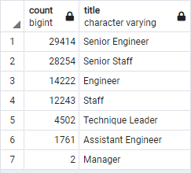
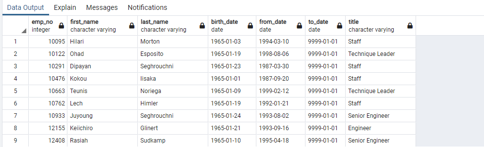
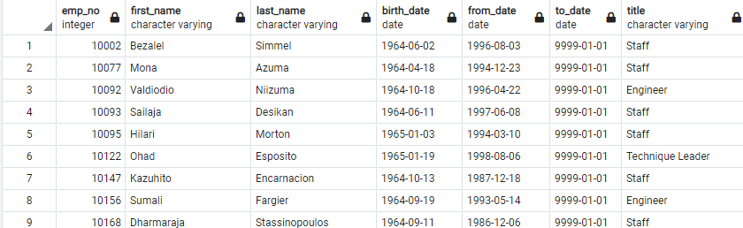

# Pewlett-Hackard-Analysis

## Overview of Pewlett Hackard Analysis: 
The purpose of this analysis is:
- to determine the number of retiring employees per title, 
- to identify employees who are eligible to participate in a mentorship program, and
- to write a summary report to help prepare Pewlett Hackard management for the “silver tsunami” as many current employees reach retirement age.

## Results of Pewlett Hackard Analysis

 ### Retiring Employees by Title
  
  
  - As shown in the Retiring Title table, Senior Engineer and Senior Staff are going to be the hardest hit roles during the silver tsunami.  
  - Senior Engineer and Senior Staff make up 64% of total retiring titles.
 
 ### Employees Eligible for Mentorship Program
  
  
  - There are only 1549 retirement ready employees eleibilbe to mentor.  
  - The majority (70%) of these employees are staff and engineers.
 

## Summary of Pewlett Hackard Analysis: 

 ### Number of Retiring Roles: 
  - According to the, retiring employees by title table below, there are 90,398 employees retiring.
  
  
  
 ### Retirement Ready Mentors:
Are there enough qualified, retirement-ready employees in the departments to mentor the next generation of Pewlett Hackard employees?
There are only 1549 retirement-ready employees eleibilbe to mentor the next generation of Pewlett Hackard employees.  This is only 2% compared to the number of retirement roles needing to be filled.  This does not seem to be a sufficient enough number to mentor the remaining employees. 

Pewlett Hackard may want to consider broadening the mentor scope to include employees born in other years in addition to 1965.  For example if you broadened the birth year of mentor employees to include one additional year, 1964, the number of eligible mentors will increase by 20%.
Broadened Mentorship Eligibility Query:

Also, as stated earlier 64% or 57668 of the retiring roles are Senior Egineere and Senior Staff.  IN addition to that, 26468 or 29%  the majority of roles retiring fall intoffering incentives to retirment eligible employees who are Senior Staff and Engineers to come back as contractors for a certain amount of time to help with the mentoring.
